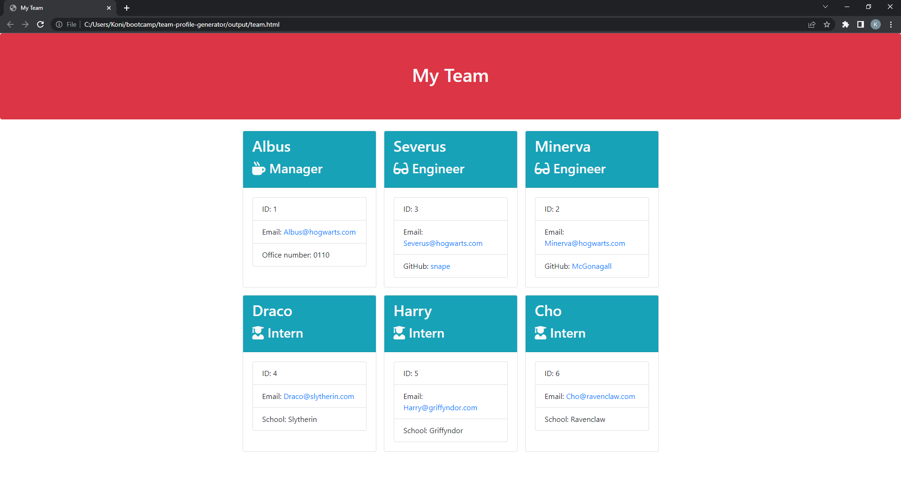

# Team Profile Generator

## Table of Contents

1. [Description](#description)
2. [Installation](#installation)
3. [Usage](#usage)
4. [License](#license)
5. [Contributing](#contributing)
6. [Tests](#tests)
7. [Questions](#questions)

## Description

The Team Profile Generator is a Node.js command-line application which takes information about employees on a software engineering team.  A summary of this information is displayed  for each person on the generated HTML webpage.

### Repository

https://github.com/digitinok/team-profile-generator/

### Sample Webpage

https://github.com/digitinok/team-profile-generator/blob/main/output/team.html

## Installation

As this is a command-line application, it will run the the terminal window.  After cloning the code from the repository, please install all the dependencies from the `package.json` file with the command `npm install`. The application uses [Jest](https://www.npmjs.com/package/jest) for running the unit tests and [Inquirer](https://www.npmjs.com/package/inquirer) for collecting input from the user.

## Usage

Run the program with `node index.js` and supply the information about the team manager and all team members when prompted.  After you have finished, the web page will be genarated and can be found in the `output` folder.

Screenshot of sample Team Webpage

## Future Improvements

Furture improvements will increase the robustness with better input validation and further testing of functions.  Further refactoring and abstractions will improve readability and maintainability.

## License

The project uses the MIT License. Please check the license file in the repository for further information about what you are allowed to do.

## Contributing

If you have any good ideas on how to improve the project, you can fork the project.

## Tests

The Employee, Manager, Engineer and Intern classes are tested with test vecters using jest. All unit tests pass using the [Jest package](https://www.npmjs.com/package/jest).  You can run the tests with `npm run tests`.

## Questions

You can find us on GitHub: https://github.com/digitinok.  
  
